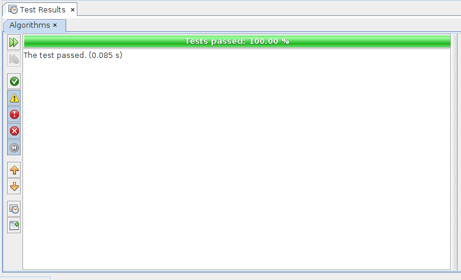
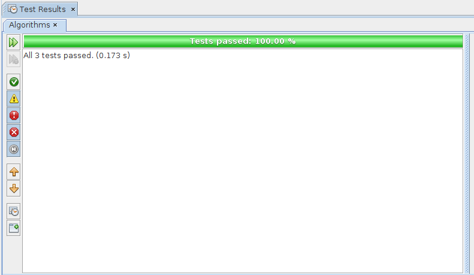

# Fundamentals Problem Set

The [book site](https://algs4.cs.princeton.edu/home/) has the pre-requirements (I'm not going to copy here) to going deep and 
solve the problems of the first chapter _1.1 Basic Programming Fundamentals_.

The basic knowledge necessary is:
- Primitive data types and expressions
- Statements
- Arrays
- Static methods
- APIs
- Strings
- Input and output

It's really complete with detailed (and others summarized) information about the Java programming fundamentals that is familiar in a whole bunch of other languages.

**Required knowledge:**

- [1. Fundamentals](https://algs4.cs.princeton.edu/10fundamentals/)
    - [1.1 Programming Model](https://algs4.cs.princeton.edu/11model/)

- [The Java Tutorials: _Learning the Java Language_](https://docs.oracle.com/javase/tutorial/java/index.html)
    - [Language Basics](https://docs.oracle.com/javase/tutorial/java/nutsandbolts/index.html)
        - [Variables](https://docs.oracle.com/javase/tutorial/java/nutsandbolts/variables.html)
        - [Operators](https://docs.oracle.com/javase/tutorial/java/nutsandbolts/operators.html)
        - [Expressions, Statements, and Blocks](https://docs.oracle.com/javase/tutorial/java/nutsandbolts/expressions.html)
        - [Control Flow Statements](https://docs.oracle.com/javase/tutorial/java/nutsandbolts/flow.html)

**I choose problems that, in my opinion, they are not hard. But should be nice to explain the process followed to solve.**

In summary, the approach is:

    1 - Decompose the problem and check if all parts were understood (the explicit and implicit).
    2 - Define inputs and outputs.
    3 - Determine (if it's not already in the statement) the procedure.
    4 - Gather some references if the problem involves related knowledge of other areas.  
    5 - Implement the solution in Java with comments to explain each part. 

## Problems

**1.1.9: Write a code fragment that puts the binary representation of a positive _integer N_ into a _String s_.**

**_Observation:_** 
The book already provides a much simpler solution:

```java
String s = "";

for (int n = N; n > 0; n /= 2) {
    s = (n % 2) + s;
}
```

compared to the [implemented](https://github.com/julianomacielferreira/Algorithms/blob/master/src/algorithms/fundamentals/DecimalTo.java) below, and there's one in the [Java API](https://docs.oracle.com/javase/8/docs/api/java/lang/Integer.html#toBinaryString-int-), too.

But, to understand why this solutions works, it's important to try to create/recreate your own implementation.

**_Solution:_** 
    
Decomposing this problem is very easy, it's giving us the input and output:

    - Inputs: an integer (int) variable N.
    - Output: a String s representing the binary form of the decimal number.
        
To define the _Procedure_,  it's necessary an overview of [Positional notation](https://en.wikipedia.org/wiki/Positional_notation) and [Numeral Systems](https://en.wikipedia.org/wiki/Numeral_system). 

The definition is taken from a [Quora](https://www.quora.com) question ["What is a positional number system?"](https://www.quora.com/What-is-a-positional-number-system)

> A positional (numeral) system is a system for representation of numbers by an ordered set of numerals symbols (called digits) in which the value of a numeral symbol depends on its position

Exemplifying:

In a straightforward manner it's saying that a decimal number, for example 36, is equal to the sum of two numbers (digits) multiplied by powers of 10. 

Reading the number from right to left (units, dozens, etc.) increases the power of the base (starting from 10 raised to 0):
 
> 36 = (6 x 10<sup>0</sup>) + (3 x 10<sup>1</sup>)<br>
> 36 = (6 x 1) + (3 x 10)<br>
> 36 = 6 + 30<br>
> 36 = 36

The quantity of numerals (symbols Indo-Arabic) is the same as the base. 

For example, base 10 has {0, 1, 2, 3, 4, 5, 6, 7, 8, 9} digits.

The rule for the symbols is: start from 0 until _base - 1_.
 
So the base two, starting from 0 until (2 - 1) has {0, 1}.

From right to left, the representation of the binary number 1010<sub>2</sub> in base ten is:

> 1010<sub>2</sub> = (0 x 2<sup>0</sup>) + (1 x 2<sup>1</sup>) + (0 x 2<sup>2</sup>) + (1 x 2<sup>3</sup>)<br>
> 1010<sub>2</sub> = (0 x 1) + (1 x 2) + (0 x 4) + (1 x 8)<br>
> 1010<sub>2</sub> = 0 + 2 + 0 + 8<br>
> 1010<sub>2</sub> = 10<br>

With all said, the problem is asking us to implement the algorithm to make the inverse of the example above, i.e, given a number in base decimal convert it to binary: 10 = 1010<sub>2</sub>.

Now, it's necessary to understand very little about [Number theory](https://en.wikipedia.org/wiki/Number_theory) basics: **Euclid's Division Algorithm**

It's about multiples and divisors of integer numbers and states the follow:

> Suppose _n_ is a natural number (i.e, 1, 2, 3, ..., etc.) not null (n > 0).<br> 
> If _m_ is a natural number, so _m_ is a multiple of _n_ OR is between two consecutive multiples of _m_.<br> 
> In algebraic notation: ( _m_ * q ) <= _n_ < _m_ * (q + 1)<br>
> If (_m_ * q) <= _n_ (a multiple of _m_ is less than _n_), implies that there's a natural number r (remainder) such that _n_ = ( _m_ * q ) + r (r < _m_).<br>
> If r = 0, so _n_ = ( _m_ * q ), i.e, _m_ is multiple of _n_.

So, summarizing the above is the theorem:

> For any natural numbers _n_ and _m_, with _m_ != 0 (not null), there exists only one pair of numbers _q_ and _r_ such that _n_ = ( _m_ * q ) + r.

Let's use numbers to see that:

> Let: ( _m_ * q ) <= _n_ < _m_ * (q + 1)<br>
> With: _n_ = 73 and _m_ = 5<br> 
> We have: (5 * q) <= 73 < 5 * (q + 1)<br>
> Then: q = 14 and (5 * 14) <= 73 < 5 * (14 + 1)<br>
> Is equal to: 70 <= 73 < 75<br>
> The only natural numbers to represent the inequality are:<br>
> q = 14, r = 73 - (5 * 14) = 3 (remember, r = _n_ - ( _m_ * q )).<br>
> So: 73 = (5 * 14) + 3.

The concepts shows that any number __n__ (n > 1) in a base __b__, with __m__ being the numerals {0, 1, 2, ..., (b - 1)}, can be represented uniquely as: 

> __n__ = m<sub>0</sub> + m<sub>1</sub> * __b__<sup>1</sup> + m<sub>2</sub> * __b__<sup>2</sup> + ... + m<sub>i</sub> * __b__<sup>i</sup> ( i >= 0 and m<sub>i</sub> != 0)

or

> __n__ = ( __b__ * q ) + m<sub>0</sub>

representing ( __b__ * q ) as:

> ( __b__ * q ) = m<sub>1</sub> * __b__<sup>1</sup> + m<sub>2</sub> * __b__<sup>2</sup> + ... + m<sub>i</sub> * __b__<sup>i</sup>

using the distributive property:

> m<sub>1</sub> * __b__<sup>1</sup> + m<sub>2</sub> * __b__<sup>2</sup> + ... + m<sub>i</sub> * __b__<sup>i</sup> = __b__ * (m<sub>1</sub> + m<sub>2</sub> * __b__<sup>1</sup> + m<sub>3</sub> * __b__<sup>2</sup> + ... + m<sub>i</sub> * __b__<sup>i - 1</sup>)

we reach the form:

> __n__ = __b__ * (m<sub>1</sub> + m<sub>2</sub> * __b__<sup>1</sup> + m<sub>3</sub> * __b__<sup>2</sup> + ... + m<sub>i</sub> * __b__<sup>i - 1</sup>) + m<sub>0</sub>

with all __m<sub>i</sub>__'s = {0, 1,..., (b - 1)}.

Plugging the example numbers:

> 36 = 10 * (3) + 6  {m<sub>0</sub>=6 and m<sub>1</sub>=3}

> 365 = 10 * (6 + 3 * 10<sup>1</sup>) + 5 {m<sub>0</sub>=5, m<sub>1</sub>=6 and m<sub>2</sub>=3}

> 1010<sub>2</sub> = 2 * (1 + 0 * 2<sup>1</sup> + 1 * 2<sup>2</sup>) + 0 {m<sub>0</sub>=0, m<sub>1</sub>=1, m<sub>2</sub>=0 and m<sub>3</sub>=1}

So to convert any number __n__ in base ten to binary, it's necessary that its representation be:

 __n__ = 2 * (m<sub>1</sub> + m<sub>2</sub> * __b__<sup>1</sup> + m<sub>3</sub> * __b__<sup>2</sup> + ... + m<sub>i</sub> * __b__<sup>i - 1</sup>) + m<sub>0</sub>

with all __m<sub>i</sub>__'s = {0, 1}.

To do that it's just a matter of using successive divisions by the base we wish to convert __keeping each remainder and the last quotient until it's {0, 1}__:

> 36 = ????<sub>2</sub>

Start dividing by the base:

> 36 / 2 = 18 (remainder=0, that's the m<sub>0</sub> digit)

The quotient is 18 not {0, 1}, keep dividing by the base:

> 18 / 2 = 9 (remainder=0, that's the m<sub>1</sub> digit)

The quotient is 9 not {0, 1}, keep dividing by the base:

> 9 / 2 = 4 (remainder=1, that's the m<sub>2</sub> digit)

The quotient is 4 not {0, 1}, keep dividing by the base:

> 4 / 2 = 2 (remainder=0, that's the m<sub>3</sub> digit)

The quotient is 2 not {0, 1}, keep dividing by the base:

> 2 / 2 = 1 (remainder=0, that's the m<sub>4</sub> digit)

Finally, the quotient is 1 (the m<sub>5</sub> digit). 

All the __m<sub>i</sub>__'s are m<sub>0</sub>=0, m<sub>1</sub>=0,  m<sub>2</sub>=1, m<sub>3</sub>=0, m<sub>4</sub>=0, m<sub>5</sub>=1.

> 36 = 2 * (m<sub>1</sub> + m<sub>2</sub> * 2<sup>1</sup> + m<sub>3</sub> * 2<sup>2</sup> + m<sub>4</sub> * 2<sup>3</sup> + m<sub>5</sub> * 2<sup>4</sup>) + m<sub>0</sub><br>
> 36 = 2 * (0 + 1 * 2<sup>1</sup> + 0 * 2<sup>2</sup> + 0 * 2<sup>3</sup> + 1 * 2<sup>4</sup>) + 0<br>
> 36 = 2 * (0 + 2 + 0 + 0 + 16) + 0<br> 
> 36 = 2 * (18) + 0<br> 
> 36 = 36

Representing as {0, 1} it's just a matter of concatenating  all __m<sub>i</sub>__'s (from right to left):

> 36 = m<sub>5</sub>m<sub>4</sub>m<sub>3</sub>m<sub>2</sub>m<sub>1</sub>m<sub>0</sub> = 100100<sub>2</sub>

Implement this procedure as a [static method](https://github.com/julianomacielferreira/Algorithms/blob/master/src/algorithms/fundamentals/DecimalTo.java) in Java:

```java
public class DecimalTo {

    public static String binary(int n) {

        // Assuming only positive integers (not dealing with sign)
        n = Math.abs(n);

        // If n is {0,1} just return it
        if (n < 2) {
            return String.valueOf(n);
        }

        // Using StringBuilder to improve performance
        StringBuilder buffer = new StringBuilder();

        // Flag to stop the iteration        
        boolean quotientNotZeroOrOne = true;

        // Start the sucessive divisions keeping the remainder    
        while (quotientNotZeroOrOne) {

            // Use module operator to get the remainder            
            int remainder = n % 2;

            // Append the remainder because it always go to the result            
            buffer.append(String.valueOf(remainder));

            // Divide by the base      
            n /= 2;

            // Check if the quotient is {0, 1} to stop the iteration      
            if (n < 2) {
                // The last quotient is the highest order term
                buffer.append(String.valueOf(n));
                
                // Set the flag to false to stop the iteration
                quotientNotZeroOrOne = false;
            }
        }

        // Return the result in reverse order (right from left)
        return buffer.reverse().toString();
    }

}
```

__Obs.:__ The problem statement does not specify, but this solution can be implemented with recursion and a Stack, LIFO (last-in-first-out). 
Soon I'm going to do that and show the difference.

The [test case](https://github.com/julianomacielferreira/Algorithms/blob/master/test/algorithms/fundamentals/DecimalToTest.java) is very simple:

```java
public class DecimalToTest {

    /**
     * Test of binary method, of class DecimalTo.
     */
    @Test
    public void testBinary() {
        assertEquals("0", DecimalTo.binary(0));
        assertEquals("1", DecimalTo.binary(1));
        assertEquals("10", DecimalTo.binary(2));
        assertEquals("1010", DecimalTo.binary(10));
        assertEquals("100100", DecimalTo.binary(36));
        assertEquals("111010110111100110100010101", DecimalTo.binary(123456789));
    }

    /**
     * Test of binary method, of class DecimalTo, compared to the Java API.
     */
    @Test
    public void testBinaryWithJavaAPI() {
        assertEquals(Integer.toBinaryString(0), DecimalTo.binary(0));
        assertEquals(Integer.toBinaryString(1), DecimalTo.binary(1));
        assertEquals(Integer.toBinaryString(2), DecimalTo.binary(2));
        assertEquals(Integer.toBinaryString(10), DecimalTo.binary(10));
        assertEquals(Integer.toBinaryString(36), DecimalTo.binary(36));
        assertEquals(Integer.toBinaryString(123456789), DecimalTo.binary(123456789));
    }

}
```



**1.1.11: Write a code fragment that prints the contents of a two-dimensional boolean array, using * to represent true and a space to represent false.
Include row and column numbers.**

**Solution:** 

The input and output to this problem are:
    
    - Input: a two-dimensiona boolean array like boolean[][] booleanArray = {{false, true}, {true, false}}
    - Output: a representation of the array using '*' for true and ' ' (space) for false

_Example:_

```java
boolean[][] booleanArray = {{false, true}, {true, false}};
```

|   | * |
|---|---|
| * |   |


**1.1.13: Write a code fragment to print the transposition (rows and columns changed) of a two-dimensional array with M rows and N columns.**

**_Solution:_** 

Decomposing this problem is very easy, it's giving us the input and output:

    - Inputs: a two-dimensional array.
    - Output: a transposed two-dimensional array.
  
_Example:_

Suppose _a_ is 3x3 matrix:

```java
Integer[][] a = {{1, 2, 3}, {4, 5, 6}, {7, 8, 9}};
```

| 1 | 2 | 3 |
|---|---|---|
| 4 | 5 | 6 |
| 7 | 8 | 9 |


the transposed is:

```java
Integer[][] b = {{1, 4, 7}, {2, 5, 8}, {3, 6, 9}};
```

| 1 | 4 | 7 |
|---|---|---|
| 2 | 5 | 8 |
| 3 | 6 | 9 |

Assuming that the two-dimensional array is not ragged, the [solution](https://github.com/julianomacielferreira/Algorithms/blob/master/src/algorithms/fundamentals/Matrix.java) is very straightforward:

```java
public class Matrix<T> {

    /**
     * Make the transposition (rows and columns changed) of a two-dimensional
     * array, NOT ragged, with M rows and N columns.
     *
     * @param <T> type of the array elements
     * @param a two-dimensional array NOT ragged.
     * @return the transpose of the array.
     */
    public static <T> T[][] transpositionOf(T a[][]) {

        // The columns of transposed is the number of rows of a (a.length).
        int columns = a.length;

        // Because a is not ragged, all rows have the same number os columns 
        // and it's enough get the length of one column.
        int rows = a[0].length;

        // Instantiate an array of base type Object, and cast it to T type.        
        T[][] transposed = (T[][]) new Object[rows][columns];

        for (int i = 0; i < a.length; i++) { // Iterate over the rows of a.  
            for (int j = 0; j < a[i].length; j++) { // Iterate over the columns of each i-row.        
                transposed[j][i] = a[i][j]; // Here is where the swap happens.
            }
        }

        return transposed;
    }
}
```

The [test case](https://github.com/julianomacielferreira/Algorithms/blob/master/test/algorithms/fundamentals/MatrixTest.java) is very simple:

```java
public class MatrixTest {

    /**
     * Test of transposition method, of class Matrix.
     */
    @Test
    public void testTranspositionOf() {

        Integer[][] a = {{1, 2, 3}, {4, 5, 6}, {7, 8, 9}};
        Integer[][] b = {{1, 4, 7}, {2, 5, 8}, {3, 6, 9}};

        assertArrayEquals(b, Matrix.transpositionOf(a));
        assertArrayEquals(a, Matrix.transpositionOf(b));

        Double[][] c = {{1.9, 2.8, 3.7}, {4.6, 5.5, 6.4}, {7.3, 8.2, 9.1}};
        Double[][] d = {{1.9, 4.6, 7.3}, {2.8, 5.5, 8.2}, {3.7, 6.4, 9.1}};

        assertArrayEquals(d, Matrix.transpositionOf(c));
        assertArrayEquals(c, Matrix.transpositionOf(d));
    }

}

```



__Obs.:__ I did not implemented the print method logic because the test case is already checking it.


**1.1.14: Write a static method **lg()** that takes an **int** value as argument and returns the largest int not larger than the base-2 logarithm of N. Do not use _Math_.**

**Solution:** @TODO - Solve it

**1.1.15: Write a static method _histogram()_ that takes an array a[] of _int_ values and an integer M as argument and returns an array of length M whose ith entry is the number of times
the integer i appeared in the argument array. If the values in a[] are all between 0 and M-1, the sum of the values int the returned array should be equal to a.length.** 

**Solution:** @TODO - Solve it

# References

- ["Algorithms, 4th Edition" by Robert Sedgewick and Kevin Wayne](https://algs4.cs.princeton.edu/home/)
- [The Java Tutorials](https://docs.oracle.com/javase/tutorial/tutorialLearningPaths.html)
- [Mathematics Fundamentals I (Brazilian Portuguese)](http://mtm.grad.ufsc.br/files/2014/04/Fundamentos-de-Matem%C3%A1tica-I.pdf)
- [Fundamentals of Arithmetic (Brazilian Portuguese)](https://livraria.ufsc.br/produto/818/fundamentos-de-aritmetica)